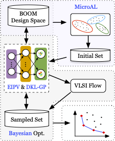
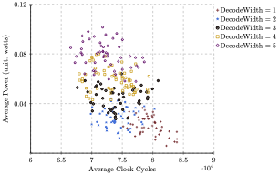
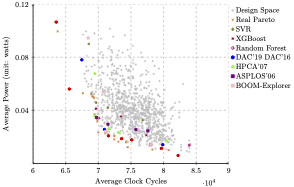

# BOOM-Explorer
BOOM Explorer: RISC-V BOOM Microarchitecture Design Space Exploration [(paper)](https://ieeexplore.ieee.org/document/9643455)


## Usage
- Get help
```bash
$ python main.py -h
```
- Run BOOM-Explorer
```bash
$ python main.py -c configs/boom-explorer.yml
```

## The overview of BOOM-Explorer




## Clustring w.r.t. the DecodeWidth



## Predicted Pareto Frontier




## TODO
- Refine the documentation
- Prepare to clean the repo


## History
- 2020/10/30 Open-source the codes


## Misc.

Please cite this work if you have used this project.
```
@inproceedings{Arch-2021ICCAD-BOOM-Explorer,
  title={{BOOM-Explorer: RISC-V BOOM Microarchitecture Design Space Exploration Framework}},
  author={Bai, Chen and Sun, Qi and Zhai, Jianwang and Ma, Yuzhe and Yu, Bei and Wong, Martin DF},
  booktitle={2021 IEEE/ACM International Conference On Computer Aided Design (ICCAD)},
  pages={1--9},
  year={2021},
  organization={IEEE}
}
```
